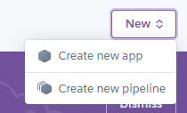
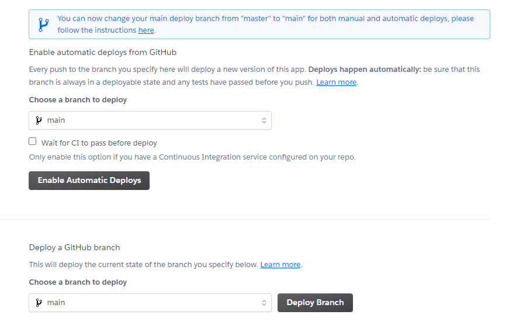

# Name of project
<!--  -->
## Live Site

[Tactical Rashers](https://tactical-rashers-a603b7e7b041.herokuapp.com/)

## Repository

[tactical-rashers](https://github.com/DaveyJH/tactical-rashers)

***

## Table of Contents

- [Name of project](#name-of-project)
  - [Live Site](#live-site)
  - [Repository](#repository)
  - [Table of Contents](#table-of-contents)
  - [Objective](#objective)
  - [Brief](#brief)
    - [Tactical Rashers](#tactical-rashers)
  - [UX − User Experience Design](#ux--user-experience-design)
    - [User Requirements](#user-requirements)
      - [First Time User](#first-time-user)
      - [Returning User](#returning-user)
    - [Initial Concept](#initial-concept)
      - [Wireframes](#wireframes)
      - [Color Scheme](#color-scheme)
      - [Typography](#typography)
        - [Title](#title)
        - [Main](#main)
      - [Imagery](#imagery)
  - [Features](#features)
    - [Existing Features](#existing-features)
    - [Future Features](#future-features)
  - [Technologies Used](#technologies-used)
    - [Node packages](#node-packages)
    - [Other Tech](#other-tech)
      - [*ScreenToGif*](#screentogif)
      - [*Windows Snipping Tool*](#windows-snipping-tool)
      - [*Visual Studio Code*](#visual-studio-code)
      - [*WAVE Evaluation Tool*](#wave-evaluation-tool)
      - [*IBM Equal Access Accessibility Checker*](#ibm-equal-access-accessibility-checker)
      - [VSCode Extensions](#vscode-extensions)
  - [Testing](#testing)
    - [Manual testing](#manual-testing)
    - [JavaScript testing](#javascript-testing)
    - [HTML Validation](#html-validation)
    - [CSS Validation](#css-validation)
    - [Lighthouse testing](#lighthouse-testing)
  - [Bugs](#bugs)
    - [Current](#current)
    - [Resolved](#resolved)
  - [Agile](#agile)
  - [Components](#components)
  - [Development](#development)
    - [GitHub](#github)
    - [VSCode](#vscode)
  - [Deployment](#deployment)
  - [Credits](#credits)
    - [Media](#media)
    - [Acknowledgments](#acknowledgments)
    - [Personal Development](#personal-development)

***

## Objective

This site is to represent capabilities with React. It will connect with a DRF
back end, allowing full CRUD functionality with well-handled user interactions.

The assessment checklist is available to view in the
[`docs/` directory](https://github.com/DaveyJH/tactical-rashers/tree/main/docs)
of the project repository.

***The needs within this project are not genuine and are made purely for the
purpose of completing my Code Institute project***

***

## Brief

### Tactical Rashers

Tactical Rashers : a backgammon players' site.  

The site should allow users to play backgammon in a manner similar to
["Chess by post"](https://en.wikipedia.org/wiki/Correspondence_chess). Users
will be able to play private games, with dice rolls handled via the app, and
comment with their intended moves. They should be able to update the main image
of the game to the latest state of a board and should be able to declare a
winner.

Full CRUD functionality should be available to allow users to interact
appropriately with the various aspects of the finished application. This repo
intends to provide a well-presented front-end React application that interfaces
seamlessly with a DRF back end.

***

## UX &#8722; User Experience Design

### User Requirements

Some example user stories that will affect the design. Please consult the
[GitHub project board](https://github.com/users/DaveyJH/projects/8/views/4) for
a full list of user concerns written in the form of GitHub issues.

Below is a non-exhaustive list of some of the user stories. Some of these are
key user stories that must be achieved for an MVP to be considered complete:

#### First Time User

> *"As a **potential player**, I would like to be able to **read the rules of
> the game** so that I **know how to play**"*
>
> *"As a **potential user**, I would like to be **able to create a profile** so
> that I **am able to play**"*

#### Returning User

> *"As a **returning user**, I would like to **quickly determine whether I am
> logged in** so that I can **log in / out as needed**"*
>
> *"As a **returning user**, I would like to **log in to my account** so that I
> can **interact with the features of the site**"*
>
> *"As a **returning user**, I would like to **view my currently active games**
> so that I can **track the progress of, and make new moves on, my games in
> play**"*
>
> *"As a **returning user**, I would like **to play a game with another
> player** so that I can **enjoy the game of backgammon**"*
>
> *"As a **returning user**, I would like **to comment on completed games** so
> that I can **interact with other users of the site**"*

***

### Initial Concept

The front-end application should provide a good UI/UX for users of the site. It
should implement the functionality of the DRF back end in a user-friendly and
error-free manner.

As a lover of board games, the application may, in time, develop into a much
broader database and front end that could allow for various types of social
games to be played remotely. For this iteration, a proof of concept and MVP is
to implement a playable backgammon application. There will be no interactive
game board due to time constraints, so the game will be played via the means of
descriptive moves being posted by each player.

#### Wireframes

Wireframes have been created as an initial visual concept using
[Balsamiq](https://balsamiq.com/). Please see
[`./docs/wireframes.md`](./docs/wireframes.md) for more pages and extra device
sizes. The `.bmpr` file is available for editing from within this repository.


Working within an agile methodology, the time constraints on the project and the
focus on "Must have" items have left too little time to add some of the UX
features shown in the wireframes. The biggest item missing is the "Top three"
players but the overall functionality of the site is not negatively impacted.

The layout for larger screens is not as pleasing as it could have been but the
functionality is, again, not impaired. If the site is to be further developed, a
UX/UI designer would be considered to assist where my skill set is lacking.

***

#### Color Scheme

A color scheme derived from a fairly classic set of backgammon board colors has been chosen for the site.


The contrast of each color has been compared using
[my own contrast checker site](https://daveyjh.github.io/Color-Contrast-Checker/). The results are shown below.


***

#### Typography

As a key aspect of the app will be written move descriptions, the font chosen is
intended to be clear and reduce cognitive overload.
[Google Fonts](https://fonts.google.com/)' monospace `Inconsolata` has been used
throughout the application, with the only variation being the title in the
header. The font used there is a little more striking as it has been deemed that
site users will not be distracted by this. The font used for the title is
`Archivo Black`.

##### Title


Archivo Black

##### Main


Inconsolata

***

#### Imagery

The style of images for logos and default games is intended to provide a clean
style with little distraction from the purpose of the site. Credits for the
images can be found in the [Media](#media) section at the bottom of this doc.

***

## Features

### Existing Features

- Create account
  > *"As a **potential user**, I would like to be **able to create a profile** so
  > that I **am able to play**"*

  New users of the site can create a profile that enables the creation of, and
  participation in, games.

- Log in
  > *"As a **returning user**, I would like to **log in to my account** so that I
  > can **interact with the features of the site**"*

  Existing users of the site can log in to their account.

- Log out
  > *"As a **signed in user**, I would like to **log out of my account** so that I
  > can **protect my account on shared devices**"*

  Existing users of the site can log out of their accounts.

- Create game
  > *"As a **returning user**, I would like **to play a game with another
  > player** so that I can **enjoy the game of backgammon**"*

  Existing users can create games with other players.

- Find relevant games
  > *"As a **returning user**, I would like **to play a game with another
  > player** so that I can **enjoy the game of backgammon**"*

  > *"As a **returning user**, I would like to **view my currently active games**
  > so that I can **track the progress of, and make new moves on, my games in
  > play**"*

  Games can be filtered and searched via the use of the player search bar. This
  is possible on the games feed, and also in their active/completed pages.

- Roll dice
  > *"As a **returning user**, I would like **to play a game with another
  > player** so that I can **enjoy the game of backgammon**"*

  Dice rolls can be made in games.

- Make a move
  > *"As a **returning user**, I would like **to play a game with another
  > player** so that I can **enjoy the game of backgammon**"*

  Moves can be noted in games. The most recent move can also be deleted or
  edited by the relevant user.

- Winner selection
  > *"As a **returning user**, I would like **to play a game with another
  > player** so that I can **enjoy the game of backgammon**"*

  Game winners can be specified.

- Mark completed game
  > *"As a **returning user**, I would like **to play a game with another
  > player** so that I can **enjoy the game of backgammon**"*

  Games can be marked as active/complete via the submission of a winner.

- Update game image
  > *"As a **returning user**, I would like **to play a game with another
  > player** so that I can **enjoy the game of backgammon**"*

  Game images can be updated by players.

- Profile editing
  > *"As a **potential user**, I would like to be **able to create a profile** so
  > that I **am able to play**"*

  Users can update their profile with some information about themself and an
  avatar.

- Display games records
  > *"As a **returning user**, I would like to **view my currently active games**
  > so that I can **track the progress of, and make new moves on, my games in
  > play**"*

  Games can be filtered and searched and winners and move counts are tracked.

***

### Future Features

- Display game requests
  > *"As a **returning user**, I would like **to play a game with another
  > player** so that I can **enjoy the game of backgammon**"*

  Games can be initiated with any other player in the current iteration. It
  would be nice to implement a "request" feature that allows the requested
  player to accept/reject the invitation.

- Comment on completed games
  > *"As a **returning user**, I would like **to comment on completed games** so
  > that I can **interact with other users of the site**"*

  This has not been worked on for this iteration. Adding this feature would
  encourage more social interaction with the site. A `Comment` model would be
  similar to the `Move` model and would only be available on games that are
  marked as complete (not active).

- Mark game as public
  > *"As a **returning user**, I would like **to play a game with another
  > player** so that I can **enjoy the game of backgammon**"*

  > *"As a **returning user**, I would like **to comment on completed games** so
  > that I can **interact with other users of the site**"*

  This feature would allow all site users to view currently active games and,
  depending on the features permitted by the players, allow comments from
  non-players during the game. For this iteration, games will only be available
  to public and non-player users once they are marked as not active.

***

## Technologies Used

### Node packages

The site is built using React v17. Additional packages include:

| package name | purpose                                                      |
| -----------: | ------------------------------------------------------------ |
| axios        | Enables network requests in a concise manner                 |
| react-bootstrap | Provides bootstrap via React components for quicker UX implementation |
| react-infinite-scroll-component | A component that allows data to be loaded in a fairly seamless manner leading to a single page for large sets of data |
| sass         | Enables customisation of bootstrap default values to reduce CSS file size and complexity |
| jwt-decode   | Handles JSON web tokens                                      |

*Further package details can be found in the `package.json` file.*

### Other Tech

#### *[ScreenToGif](https://www.screentogif.com/)*

A screen recording tool that provides a quick and easy method to record
some UI features.

#### *[Windows Snipping Tool](https://support.microsoft.com/en-us/windows/use-snipping-tool-to-capture-screenshots-00246869-1843-655f-f220-97299b865f6b)*

A screenshot tool built into Windows. It allows quick, partial screenshots
to be taken that can be saved as image files.

#### *[Visual Studio Code](https://code.visualstudio.com/)*

A free, streamlined code editor. The [extensions](#vscode-extensions)
available have allowed me to customize my workspace and become more
efficient.

#### *[WAVE Evaluation Tool](https://chromewebstore.google.com/detail/wave-evaluation-tool/jbbplnpkjmmeebjpijfedlgcdilocofh)*

WAVE is a web accessibility evaluation tool developed by WebAIM.org.

#### *[IBM Equal Access Accessibility Checker](https://chromewebstore.google.com/detail/ibm-equal-access-accessib/lkcagbfjnkomcinoddgooolagloogehp)*

The IBM Equal Access Accessibility Checker is an open-source tool for web
developers and auditors that utilizes IBM's accessibility rule engine, which
detects accessibility issues for web pages and web applications.

#### VSCode Extensions

Links to the VSCode marketplace for each extension used throughout this project:

- [Better Comments](https://marketplace.visualstudio.com/items?itemName=aaron-bond.better-comments)
- [GitHub Pull Request and Issue Provider](https://marketplace.visualstudio.com/items?itemName=GitHub.vscode-pull-request-github)
- [Highlight Matching Tag](https://marketplace.visualstudio.com/items?itemName=vincaslt.highlight-matching-tag)
- [Markdown All in One](https://marketplace.visualstudio.com/items?itemName=yzhang.markdown-all-in-one)
- [markdownlint](https://marketplace.visualstudio.com/items?itemName=DavidAnson.vscode-markdownlint)
- [Reflow Markdown](https://marketplace.visualstudio.com/items?itemName=marvhen.reflow-markdown)
- [Code Spell Checker](https://marketplace.visualstudio.com/items?itemName=streetsidesoftware.code-spell-checker)
- [Prettier - Code formatter](https://marketplace.visualstudio.com/items?itemName=esbenp.prettier-vscode)
- [ES7 React Snippets](https://marketplace.visualstudio.com/items?itemName=dsznajder.es7-react-js-snippets)
- [ESLint](https://marketplace.visualstudio.com/items?itemName=dbaeumer.vscode-eslint)

***

## Testing

### Manual testing

The features of the site have been extensively tested throughout the development process.

- Multiple users created
- Multiple games created with a variety of different users as players
- Dice and moves created in the appropriate games
- Moves updated and deleted where appropriate
- Profiles updated, including images, info and passwords and confirmed as
  non-editable by unauthorised users
- Search features tested with various usernames
- Active/completed pages viewed by authorized user and confirmed as not-viewable
  by an unauthorized user
- Sign-in, -up and -out functionality confirmed as working as intended
- Games are viewable as expected
  - A user can view an active game that they are not a part of if they type the
    game ID into the relevant URL. However, they cannot interact with the game
    so this is acceptable for this iteration of release.
- Full CRUD functionality exists depending on user authorization and game status

All data generated during development has been removed from the database.

### JavaScript testing

ESLint has been run on the entire `src` directory, using the command below, and
[saved in JSON format](./docs/tests/eslint.json). The output has been formatted
for easier readability. No errors have been reported.

`npx eslint src --ext .js --format json --output-file docs/tests/eslint.json`

### HTML Validation

As the majority of content is written in JSX it is impractical to use a standard
HTML validator such as [W3C](https://validator.w3.org/). All pages have been
viewed in Google Chrome with the
[WAVE web accessibility evaluation tool](https://chromewebstore.google.com/detail/wave-evaluation-tool/jbbplnpkjmmeebjpijfedlgcdilocofh)
and no errors have been reported. Further tests were done using
[IBM's Equal Access Accessibility Checker](https://chromewebstore.google.com/detail/ibm-equal-access-accessib/lkcagbfjnkomcinoddgooolagloogehp)
and the only errors raised were from packages utilized and not from code written
by me.

### CSS Validation

All CSS file contents have been run through the
[W3C Jigsaw validator](https://jigsaw.w3.org/css-validator/#validate_by_input)
with no errors reported.


### Lighthouse testing

Lighthouse testing has been performed. The results are satisfactory with the
suggested modifications mainly relating to image formats that would need to be
handled when uploading. There are warnings about load times due to the API calls
but there is a significant indication to users that this is happening.


***

## Bugs

### Current

1. A user can view an active game if they are not a player of that game.

*Due to the rendering cycle and the load times of various data. Time has not
been spent to implement the redirection of users away from games that are active
when they are not players in that game.*

1. Cross-site tracking prevents login status on iOS devices.

*A known limitation of having the back-end DRF and front-end App served from
separate hosts is that many Apple devices will not allow functionality. As this
is a known issue with the learning material this has not been resolved for this
iteration. It can be avoided on those devices by turning off "Prevent cross-site
tracking" in the device's settings.*

***

### Resolved

1. Bootstrap styles were overriding the intended site styling.
  
    Installed `sass` and created `override.scss` file linked in `index.js` to allow
    modification of Bootstrap variables

    *https://create-react-app.dev/docs/adding-bootstrap/#using-a-custom-theme*

    

1. The button for image uploads was not enabled when it should be.
1. If canceling an image upload, the image shown remained as the newly selected
   image rather than reverting to the original game image.
  
    Modified logic for `enabled` prop on the component and updated close method
    of modal.

    

1. Selecting an opponent was not possible.

    The context for all profiles was updated to remove the need to query the
    `data` property of the object and had not been updated in the dropdown
    population code. Removal of the `data` property has allowed the list to be
    populated with all profile names (other than the currently logged in user)/

    

1. Declaring a win in a game did not always register in the win counter
   component.

    Winner declaration was changed to update relevant contexts so that updated
    information is shown to a user.

    

1. When signing in, a 404 or 400 error was being reported for a call to the API with a parameter of `"undefined"`.

    This is likely due to the way the contexts are being implemented but a workaround has been to implement a check on not just the falsy value of
    `undefined` but also on the string value of `"undefined"`. No further errors
    are being raised.

1. Move and dice-related error messages were not helpful to users.

    Rather than reconfiguring the back end to show a more appropriate error
    (ideal resolution), I have created a custom error message for these
    situations.

1. If a user deleted their move games could show incorrect ordering of moves.

    An additional check has been implemented via an API call. Unfortunately, due
    to the lack off webhooks, this appears to be the only way to handle this
    situation without extensive additional work. The additional network request
    is unfortunate and seems to be best handled by a redesign of the back-end
    models. There is not enough time to implement this change at this stage of
    development, so the work around will have to suffice.

***

## Agile

A GitHub project was created for the site's development. The project is shared
between the back-end API and the front-end React application. Labels have been
used to help organize the tasks involved and can be filtered as needed. There
are multiple views already available on the
[Project](https://github.com/users/DaveyJH/projects/8/views/1).

An Agile approach has been used to ensure an MVP has been created in time for
release (project submission). Issues have sprint points assigned for their
effort to complete and have been assigned to Milestones to reflect a sprint
process. Sprints were started with a total story point availability of 20 and
reviewed at the end of the sprint. The sprint point availability for my efforts
was adjusted to allow a maximum of 25 within a sprint as the initial value was
not reflective of my ability.

Separate views have been created for each sprint to allow a clear visual of the
progress being made. Separate views for docs and user stories also exist for an
overview.

***

## Components

The React framework allows the reuse of components throughout a project to
speed up development time. The components in this project have been separated
into relevant directories and utilized where necessary. Some components are made
up of smaller components, allowing for more concise files that are easier to
maintain.

The `GameBrief` component and the `DiceAndMoves` component are the most reused
in this project and allow for a concise page structure, abstracting a lot of the
logic to more suitable files. The `RulesSection` also allows for a non-technical
maintainer to update the `RulesContent` object in a fairly straight forward way
with little knowledge of how React itself works.

## Development

The site was developed using [git](https://git-scm.com/), [GitHub](#github) and
[VSCode](#vscode). The repository is available for cloning or forking but no
additional contributions will be accepted at this time.

To clone the repo please see the steps below.

### [GitHub](https://github.com)

- Sign in to GitHub.


- Navigate to the repository at https://github.com/DaveyJH/tactical-rashers,
  click **&#60;&#62; Code &#9662;** and copy the URL provided.


- Proceed to your chosen method of cloning a repo and provide the copied URL
  when needed.

### [VSCode](https://code.visualstudio.com/)

I have a number of extensions installed to aid my development in VSCode. The
steps below work for me, but alternative methods are available. Please consult
the relevant docs for various approaches. Node v16.20 was used to develop this
application and is recommended for compatibility.

- Open a `bash` terminal within VSCode and navigate to a parent directory for
  your repository.


- Enter `git clone https://github.com/DaveyJH/tactical-rashers.git` (the URL
  copied from GitHub). This will clone the repository into a new
  directory called `tactical-rashers`.


- Enter the command `cd tactical-rashers && code . -r` to open the repository in
  the current VSCode window.


- Enter the command `npm i` to install node packages.


- Ensure to update **line 3** of `src/api/axiosDefaults.js` with the URL of your
  deployed back-end API.

## Deployment

The application is deployed on Heroku; the steps below detail the process to achieve this.

1. Ensure you have a Procfile with the following content:
   ```
    web: serve -s build
   ```
1. Navigate to your [Heroku dashboard](https://dashboard.heroku.com/apps)
1. Click "New" and select "Create new app".  
  
1. Input a meaningful name for your app and choose the region best suited to
  your location.  
  
1. Select "Deploy" from the tabs.  

1. Select "GitHub - Connect to GitHub" from deployment methods.  
 
1. Click "Connect to GitHub" in the created section.  
 
1. Search for the GitHub repository by name.  
 
1. Click to connect to the relevant repo.  
 
1. Either click `Enable Automatic Deploys` for automatic deploys, or `Deploy
 Branch` to deploy manually. Manually deployed branches will need
 re-deploying each time the repo is updated.  
 
1. Click `View` to view the deployed site.  
    

The live site can also be accessed from your repo in GitHub from the
Deployments section of the repo.

- Click the link to view the deployment history.  
  
- Click the provided URL.  
  

***

## Credits

### Media

- The favicon comes from [flaticon](https://www.flaticon.com/free-icon/backgammon_7399635?related_id=7399513&origin=search).

### Acknowledgments

Thanks to [@CluelessBiker](https://github.com/CluelessBiker), my mentor for the
project, as she helped me focus on the MVP and gave great support regarding the
project planning process.

As always, the wonderful staff at [Code Institute](https://codeinstitute.net/)
for introducing me to this framework and providing me with the foundations to
start developing this application.

***

### Personal Development

Having now built my own React project with very little starter code, I would
approach various elements differently. I am unhappy with the styling of the
site, but the assessment criteria do not require a high-quality level of
front-end design, only that it meets the principles of UX design. I would be
unlikely to use Bootstrap so broadly as it leads to a particular look that is
not very tailor-made unless a lot more time is spent overriding it. Now that I
feel I have a better understanding of how things piece together in React, I
would prefer to develop the back end at the same time as the front, with each
user story for the front and back being completed simultaneously. If this is not
possible on a project, I feel I have more knowledge to provide a better
foundation in the back end for the front end to integrate with.
